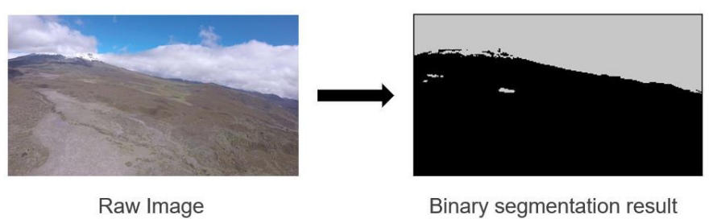
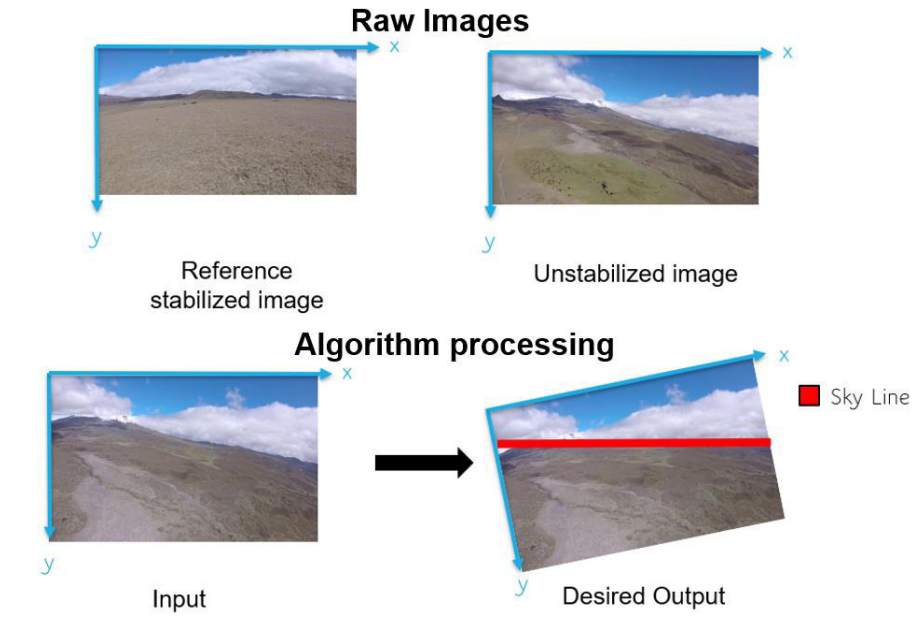
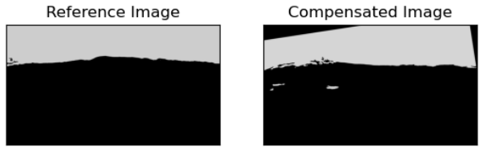
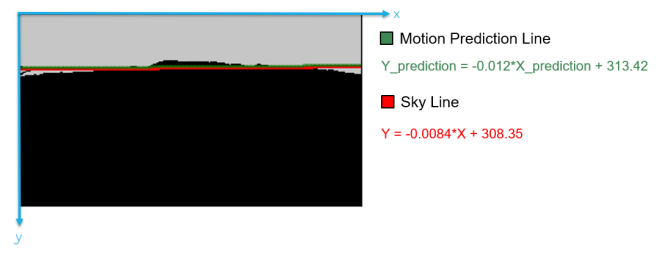

# Skyline Detection and Motion Compensation

This repository contains two implementations of algorithms to detect and track the skyline and ground plane in outdoor environments. The goal is to stabilize images by compensating for roll and pitch motions using skyline segmentation and prediction.

The methods are based on the Bachelor's Thesis: [Design and simulation of a computer vision-controlled camera stabilizer for a fixed-wing unmanned aerial vehicle](https://bibdigital.epn.edu.ec/handle/15000/22453?locale=en).

---

## 1. Dataset and Preprocessing
The **SkyFinder dataset** ([link](https://mvrl.cse.wustl.edu/datasets/skyfinder/)) was used to train a UNet deep learning model for sky/ground segmentation. The implementation of UNet was adapted from [milesial/Pytorch-UNet](https://github.com/milesial/Pytorch-UNet).

The segmentation produces binary masks separating the sky and ground. These masks are then processed to extract the skyline coordinates.



---

## 2. Real-Time Skyline Detection
File: `skyline_realtime.py`

This script runs in real time using a camera feed (Raspberry Pi camera or USB webcam). It detects the skyline, estimates the reference plane, and calculates roll and pitch compensation angles. The algorithm predicts skyline motion and applies geometric transformations to stabilize the image.



---

## 3. Static Image Skyline Compensation
File: `skyline_static.py`

This script processes a batch of static images. It estimates motion between consecutive frames and compensates roll and pitch movements by rotating and translating the image. It also includes motion prediction to anticipate skyline movement.




---

## 4. Motion Prediction Line
The motion prediction line (green) forecasts the skyline's next position based on previous slope and intercept values. This reduces errors caused by sudden changes and helps maintain stable compensation.


---

## 5. Requirements
To run the scripts, install the following dependencies:

```bash
pip install numpy opencv-python sympy imutils matplotlib
```

---

## 6. Reference
For the full details of the methodology, experiments, and results, read the complete thesis here:  
[Design and simulation of a computer vision-controlled camera stabilizer for a fixed-wing unmanned aerial vehicle.](https://bibdigital.epn.edu.ec/handle/15000/22453?locale=en)
